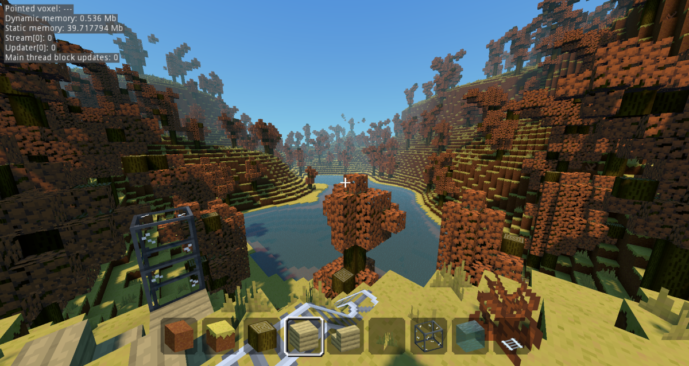

This is a Pre-Alpha test / tinkering build. You will need this (I'm using mono / .NET / C# godot voxel custom engine for testing) https://github.com/Zylann/godot_voxel/actions/workflows/mono.yml + (most current build). e.g. https://github.com/Zylann/godot_voxel/actions/runs/12286474548 > (if you use linux select:
"godot.linuxbsd.editor.x86_64.mono")

(or the windows one if you use windows 
"godot.windows.editor.x86_64.mono")

Unzip the custom godot voxel engine and game .zip

Then launch that custom 4.3_stable mono.NET / C# Godot Voxel engine and start the MMOARPG-TinyMMO-VoxelGame-Pre-Alpha-V.0.0.1 

Then select run multiple instances via the debug menu > run multiple instances (2+)

Then on the first game window drag it over so the second one is not overlapped (optional)

Then select "Host" on the first window game start menu (it will load in the world on the 'host' client)

Then on subsequent clients select "Join" on the game start menu (it will load in the world for the 'join(ed)' clients and players should be able to see oneanother and share world iterations and voxel block changes.

Enjoy.

Feel free to ask questions. All feedback is welcome.

Voxel game demos (Godot Engine 4.3)
====================================

This project contains several scenes to test and demo the voxel module I'm developing for Godot Engine.

Dependencies
---------------

This project uses a C++ module:
- [Voxel](https://github.com/Zylann/godot_voxel)

For the old (unmaintained) pure-GDScript version, checkout the branch `full_gdscript`.

Runnable scenes
-----------------

- `blocky_game/main.tscn`: sort of Minecraft clone with random features.
- `blocky_terrain/main.tscn`: simple test for blocky terrain
- `smooth_terrain/main.tscn`: simple test for Transvoxel smooth terrain

Blocky Game
------------

This game is a demo meant to be a practical example of using `VoxelTerrain` with a blocky look. It is not complete, some features might be incomplete, but it doesn't aim to be a finished game.

It can be played in multiplayer. You can either host a game, join a game, or play without multiplayer.
Synchronization is very basic: players are authoritative of their physics, but voxels are sent by the server, and edited on the server.
